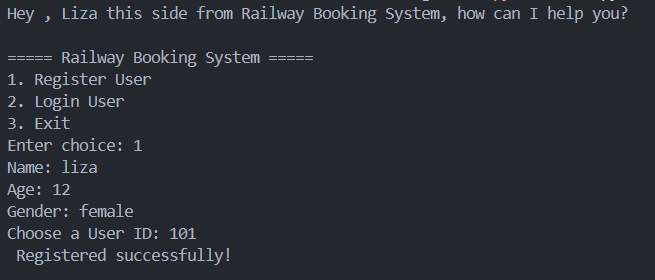
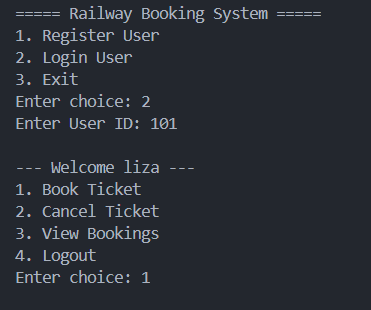
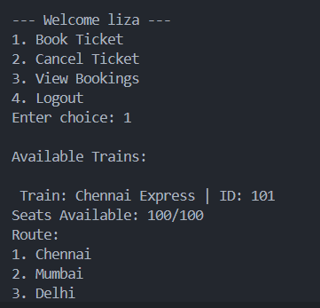

# SIMPLE RAILWAY MANAGEMENT SYSTEM

# Register

# Login

# Book/View/Cancel


#  Run main.py (main file)

```
python main.py
```

# Features 
- booking , cancelling , viewing tickets
- train data (consists of train id , name , seats available , route and schedule)
- train data can be managed using data.py and schedule.py
- all functionalities can be managed by manager.py

# Tech Stack
- Python (OOP)
